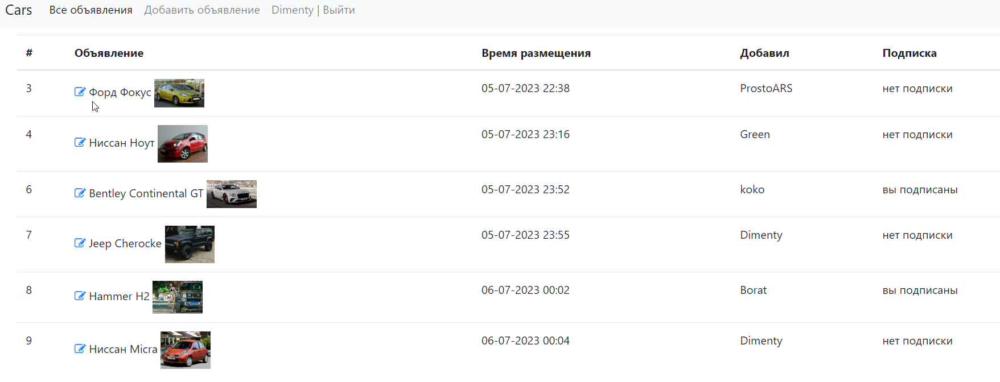
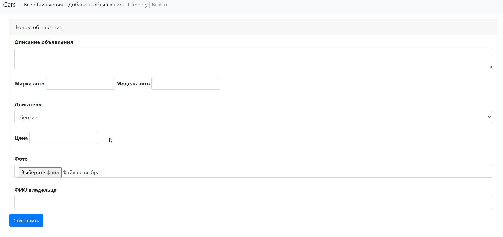
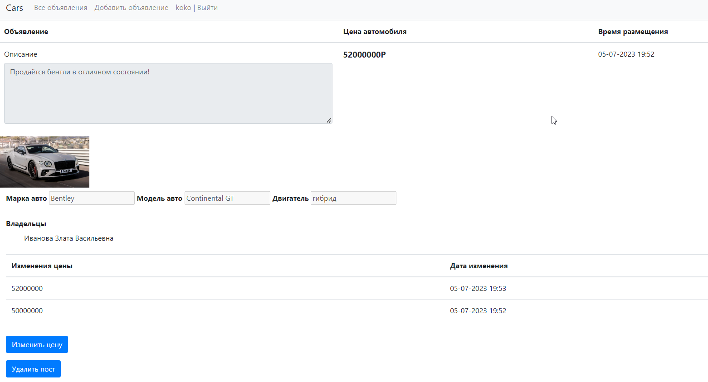

# job4j_cars

### Описание приложения
Реализовываем магазин по продаже машин.
### Используемый стек технологий
- Java 17
- Spring boot 
- Thymeleaf
- Hibernate 
- Liquibase 
- PostgreSQL 

### Для запуска проекта понадобятся
- JDK 17
- Apache Maven
- PostgreSQL 
- Web browser
### Запуск приложения
- Открыть диалоговое окно комбинацией клавиш Win+R;
- В диалоговом окне прописать cmd и нажать OK;
- Подключиться к PostgreSQL командой psql --username=USER_NAME и ввести пароль;
- Создать базу данных cinema командой create database cinema;
- Подключиться к базе данных командой \c cinema;
- Выйти из терминала psql командой \q;
- Перейти в корневую папку проекта;
- Запустить приложение командой mvn spring-boot:run;
- Перейти по ссылке http://localhost:8080/index в браузере.
### Главная страница

### Страница создания поста

### Страница просмотра поста
